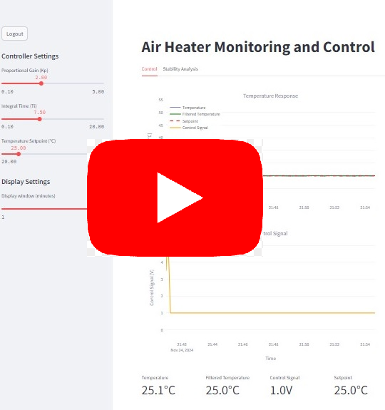

# iiot_and_cybersecurity
Industry 4.0, IIoT (Industrial Internet of Things) and Cyber Security

# Video Demo
A video demonstration of the Monitoring and Control System for Industrial Internet of Things is available within this repository. It provides an overview of the application's functionality and key features implemented as per Industry 4.0 and Cyber security best practices. [Watch the video here](https://youtu.be/GS97DElMbIc).

